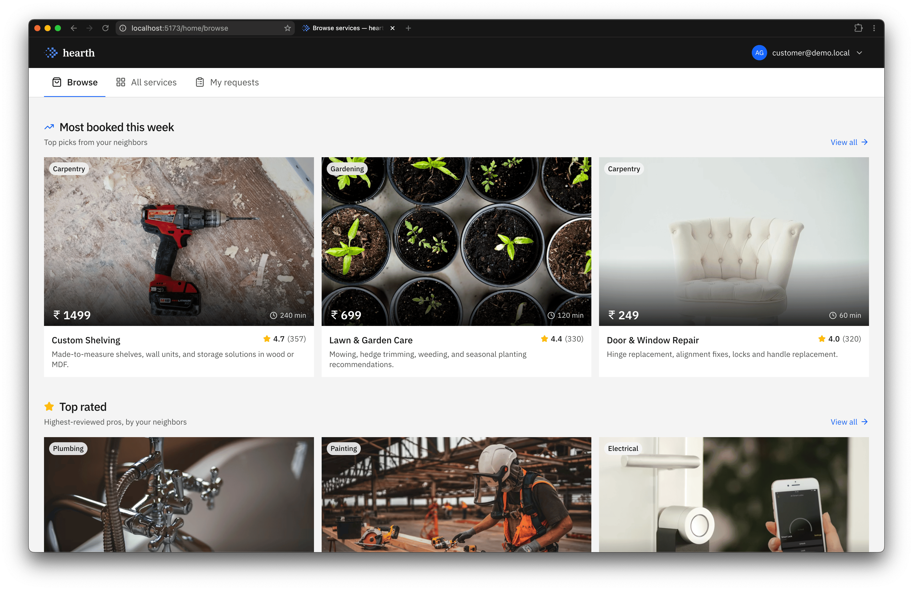
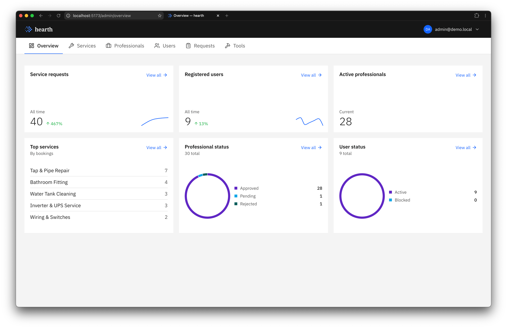
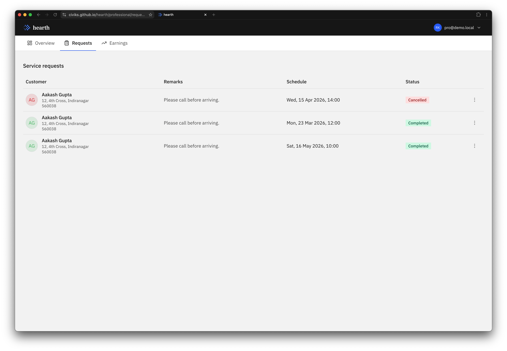
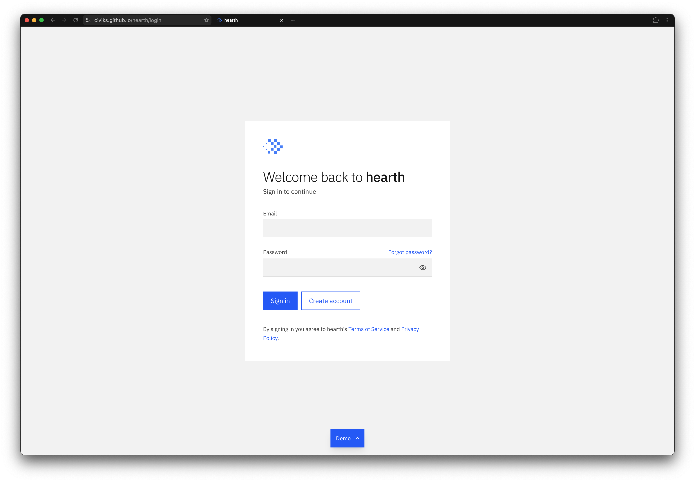

# hearth

[demo](https://civiks.github.io/hearth/) · [docker](#docker) · [setup](#setup) · [todo](TODO.md)

> A marketplace for home services.

## Highlights

- **Multi-role marketplace** — customers book services, professionals accept and fulfill, admins approve professionals and moderate the catalogue
- **Booking lifecycle** — `requested → assigned → in_progress → completed` (or `cancelled`); transitions are role-gated on the server and mirrored by client state
- **Background pipelines** — Celery beat schedules daily reminder emails to professionals with pending requests and monthly activity reports to customers; admins kick off CSV exports as async jobs and poll for the download
- **Role-aware analytics** — Chart.js dashboards: system-wide metrics for admin, personal earnings and status mix for professionals
- **RBAC end-to-end** — FastAPI dependencies guard every protected route by role; Vue Router runs the same guards client-side to keep routes unreachable for the wrong role
- **Cookie auth + rate limiting** — JWT in `HttpOnly` cookies, `slowapi` token buckets on the public auth endpoints
- **Generated API client** — TypeScript types regenerated from `/openapi.json`

## Gallery









## Stack

| | |
| --- | --- |
| **Backend** | Python 3.13, FastAPI, SQLAlchemy 2.0 (typed), Alembic, Pydantic v2, Celery, Redis, PostgreSQL |
| **Frontend** | Vue 3, TypeScript, Vite, Pinia, Tailwind CSS, Chart.js |
| **Infra** | Docker |
| **Tooling** | pytest, Ruff, vue-tsc, ESLint |

## Docker

```bash
docker run -p 8000:8000 -v hearth-data:/data ghcr.io/civiks/hearth:latest
```

Open <http://localhost:8000>. `make docker-build` / `make docker-run` for a local build.

## Setup

Requires Python 3.13, Node 24, pnpm, and Postgres + Redis (native or `docker compose up -d`).

```bash
make install            # uv sync + pnpm install
cp .env.example .env
make migrate seed       # Alembic upgrade + seed data
```

Run the stack, one process per terminal:

```bash
make backend            # FastAPI on :8000
make worker             # Celery worker
make beat               # Celery beat
make frontend           # Vite on :5173
make demo               # VITE_DEMO=1 — frontend only, in-browser mocks
```

`make help` lists every target.

### Seeded credentials

| Role         | Email                | Password  |
| ------------ | -------------------- | --------- |
| Admin        | `admin@email.com`    | `admin`   |
| Customer     | `user01@email.com`   | `user01`  |
| Professional | `plumber@email.com`  | `pass123` |

Demo build accepts any password with `admin@demo.local`, `customer@demo.local`, or `pro@demo.local`.

## Tests

```bash
make test               # pytest, 22 tests
make lint               # ruff check
make typecheck          # vue-tsc
```

## Layout

```
backend/
  api/routers/      endpoints
  celery/           background tasks
  core/             config, db, security
  schemas/          Pydantic models
  services/         business logic
frontend/src/
  views/            per-route SFCs
  components/       shared UI + shadcn-vue primitives
  layouts/          dashboard / auth / public
  lib/demo/         static demo mock layer
```

## License

[MIT](LICENSE)
